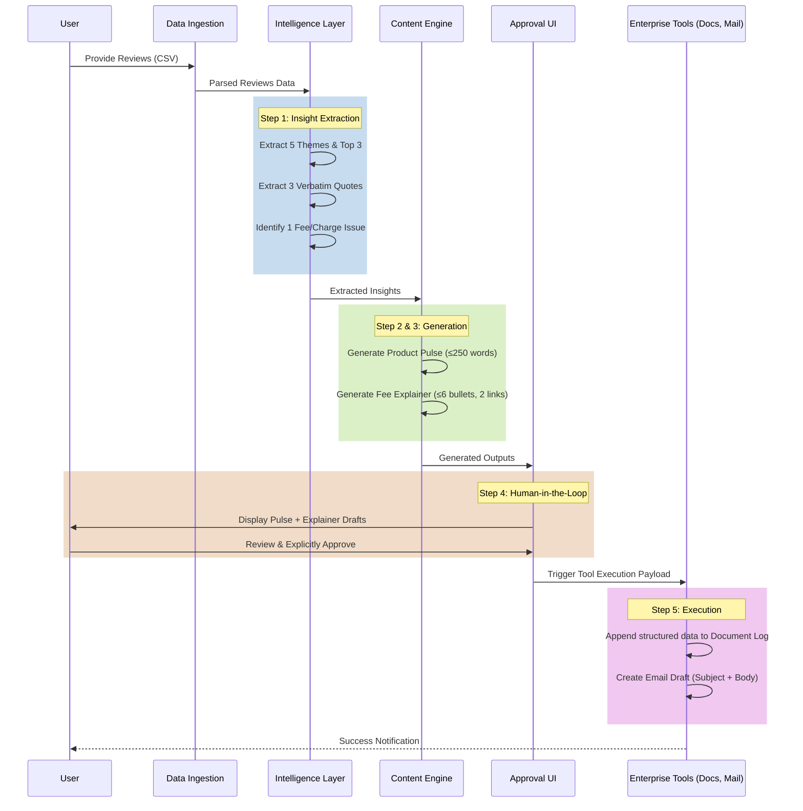

# Product Insights Copilot: Technical Architecture

## 1. System Overview

The Product Insights Copilot is an AI-driven, approval-gated workflow system designed to automate the transformation of raw, unstructured customer reviews into actionable internal product insights and customer-facing support artifacts. The system leverages Large Language Models (LLMs) for natural language understanding and generation, coupled with the Model Context Protocol (MCP) or equivalent tool-calling patterns to securely interface with enterprise tools (Document Management and Email Clients) following a mandatory human-in-the-loop validation step.

## 2. Core Architecture Components

The system is composed of five distinct modular layers:

### 2.1. Data Ingestion & Preprocessing Layer
*   **Component**: `ReviewIngestor`
*   **Input**: Public reviews CSV (historical data covering 8-12 weeks).
*   **Responsibilities**:
    *   Parse CSV data (using Pandas).
    *   Clean and sanitize data (handle missing values, normalize text).
    *   Implement data chunking or sampling if the dataset exceeds the LLM context window.
*   **Output**: Structured collection of review texts.

### 2.2. Intelligence Extraction Layer
*   **Component**: `InsightExtractor`
*   **Core Technologies**: LangChain/LlamaIndex, OpenAI GPT-4o / Anthropic Claude 3.5 Sonnet.
*   **Responsibilities**:
    *   **Theme Clustering**: Uses LLM summarization or embedding-based clustering to group reviews into ≤5 distinct themes.
    *   **Prioritization**: Ranks themes by frequency and severity to identify the Top 3.
    *   **Quote Extraction**: Extracts exactly 3 verbatim user quotes that best represent the top themes directly from the source text.
    *   **Fee Confusion Detection**: Executes a targeted prompt to identify 1 recurring misunderstanding or pain point specifically related to a fee, charge, or pricing.
*   **Output**: `ExtractedInsights` Data Object.

### 2.3. Content Generation Engine
This engine utilizes the outputs from the Intelligence Layer to construct the required deliverables.

*   **Sub-component A: `ProductPulseGenerator`**
    *   **Input**: Top 3 themes, 3 quotes, identified fee issue.
    *   **Logic**: Uses a constrained system prompt to produce a strictly formatted, ≤250-word document containing:
        *   Summary of top themes.
        *   Supporting user quotes.
        *   Key observation (trend/problem analysis).
        *   3 concrete action ideas for the product team.

*   **Sub-component B: `FeeExplainerGenerator`**
    *   **Input**: Identified fee confusion topic.
    *   **Logic**:
        *   Generates a ≤6 bullet point explanation clarifying the specific fee.
        *   Enforces a strict "neutral, facts-only tone" (no marketing speak).
        *   Appends exactly 2 official source URLs.
        *   Appends a timestamp footer: "Last checked: [Current Date/Time]".

### 2.4. Orchestration & Approval Gating
*   **Component**: `WorkflowOrchestrator` & `HumanApprovalGate`
*   **Responsibilities**:
    *   Aggregates the generated Product Pulse and Fee Explainer.
    *   Presents a consolidated preview to the human operator (e.g., via a Streamlit UI, Gradio app, or CLI prompt).
    *   **Approval Gate**: System state pauses. Execution halts until explicit boolean approval (`is_approved == True`) is received from the user.

### 2.5. Tool Execution Layer (MCP / API Clients)
*   **Component**: `ToolExecutor`
*   **Responsibilities**:
    *   Activated strictly post-approval. Triggers downstream API calls.
    *   **Action 1 (Document Append)**: Formats the insights into a structured JSON/text payload and authenticates with a Document API (e.g., Google Docs, Notion, or simple local file append) to log the entry.
    *   **Action 2 (Email Draft Creation)**: Formats the email structure (Subject + Body) and authenticates with an Email API (e.g., Gmail API) to create an unsent draft.

---

## 3. Data Flow Architecture



---

## 4. Component Interface Specifications (JSON Schemas)

### 4.1. Extraction Output Payload
```json
{
  "top_themes": ["Hidden charges", "App crashes during payment", "Confusing dashboard"],
  "quotes": [
    "Why was I charged an exit load? Nobody told me.",
    "The app crashed three times when I tried to pay.",
    "I can't find where my portfolio breakdown is."
  ],
  "fee_issue": {
    "topic": "Exit Load Misunderstanding",
    "context": "Users are surprised by the 1% exit load applied on redemptions made before 365 days."
  }
}
```

### 4.2. Document Integration Payload (Final Output)
```json
{
  "date": "2026-05-15",
  "top_themes": ["Hidden charges", "App crashes during payment", "Confusing dashboard"],
  "weekly_pulse": "### Weekly Product Pulse\n**Themes:** ...\n**Quotes:** ...\n**Observation:** ...\n**Actions:** ...",
  "identified_fee_issue": "Exit Load Misunderstanding",
  "explanation_bullets": [
    "An exit load of 1% applies to units redeemed within 365 days.",
    "No exit load is applicable after 1 year.",
    "This is standard practice to discourage short-term trading."
  ],
  "source_links": [
    "https://example-amc.com/fees-structure",
    "https://example-amc.com/sid"
  ]
}
```

---

## 5. Technology Stack Recommendations

| Layer | Recommended Technology | Justification |
| :--- | :--- | :--- |
| **Language** | Python 3.10+ | Standard for AI/Data workflows. |
| **Data Handling** | `pandas` | Simplifies CSV parsing and data extraction. |
| **LLM Orchestration** | `LangChain` (or raw OpenAI SDK) | Facilitates structured output parsing (Pydantic) and tool definition. |
| **Foundation Model** | `gpt-4o` or `claude-3.5-sonnet` | Requires high reasoning capability for accurate theme extraction and tone control. |
| **UI / Approval Gate** | `Streamlit` | Rapid creation of a dashboard for displaying text and an "Approve/Reject" button. |
| **MCP / Integrations** | `google-api-python-client` (Gmail/Docs) | Reliable APIs for creating email drafts and appending to documents. |

## 6. Implementation Considerations & Risks

1.  **Context Limitations**: If the CSV contains thousands of rows, feeding it directly to an LLM will exceed context limits or degrade reasoning quality.
    *   *Solution*: Implement a pre-processing step to sample the most relevant/recent reviews, or use a map-reduce summarization strategy.
2.  **Tone & Hallucination Management**: The explainer must be strictly factual.
    *   *Solution*: Use a system prompt that strictly forbids marketing language and mandates a low temperature setting (`temperature=0.0`) for the explainer generation. Provide hardcoded official URLs if building a true RAG system is out of scope.
3.  **Idempotency & Error Handling**: Tool calling can fail mid-execution.
    *   *Solution*: Ensure the MCP/Tool execution step clearly reports success/failure for each individual action (Doc vs. Email) so partial failures can be handled without re-triggering the entire LLM pipeline.
